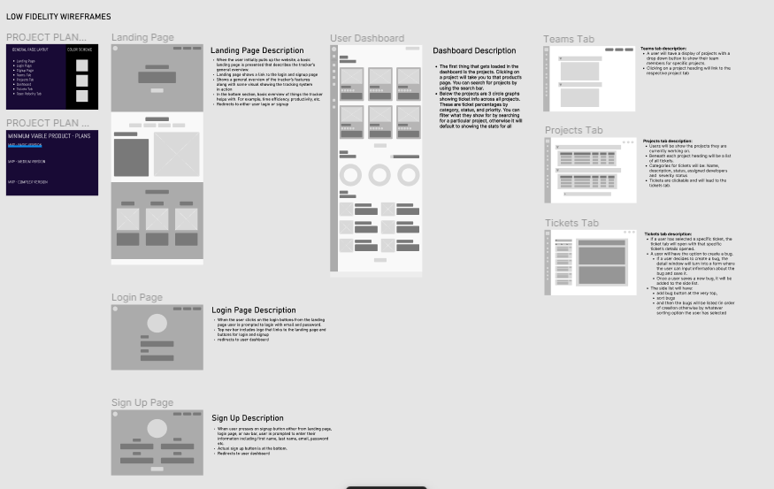
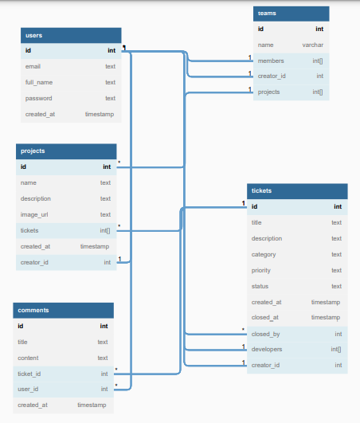

# Project Plan

Pod Members: **Katherin Jimenez, Doris Sanchez Velasquez, Aaron Alemi**

## Problem Statement and Description

Insert the latest summary of your problem statement and app description.

Bug trackers are aimed towards large companies with large development teams, with common issues being a slow response time and an overwhelming amount of information shown at once. Our bug tracker will be aimed towards smaller companies/dev teams and small group projects and focus on making the site condensed and simplified.

## User Roles and Personas

Include the most up-to-date user roles and personas.

* USER ROLES
    * Manager: a user who assigns tasks/bugs to employees on created teams and maximizing company’s workflow through the use of the bug tracking system
    * Employee: a user who will be assigned tasks/bugs/teams by manager 

* MANAGER PERSONAS

    * Josh is the CEO of his small business and resides in a suburb of Pittsburgh, Philadelphia. He would like to increase his business’s profits through his website but has noticed a lot of bugs on the website. He decides that he will need to supply his managers with a bug tracking system that they can use to help manage the bugs and assign employees to them in an organized way. However, all the bug tracking systems he and his team have come across seem to be too complex for his small business. 

    * Sarah is the project manager for a small development team at a start-up company in New York. Her team has decided to implement a series of updates to their current company website but have very time restrictive deadlines to create and deploy these updates. Sarah is in charge of setting the schedule for the sprints and what updates can be completed within different time frames. However, the current tracking system her team uses only provides complex statistics of the bugs rather than the speed they are being solved. Sarah wants to find a tracking system that will give her simplified productivity reports on the speed of bug resolutions and wishes to automate the time recommendations.

* EMPLOYEE PERSONAS

    * Robert is a software developer from a small start-up business in the city of Austin, Texas. His software team has been struggling to keep up with deadlines and are seeking different websites or applications to increase their productivity and time efficiency after encountering so many bugs on their website. Robert’s team decided to use a complex bug tracking system to fix these technical issues but have trouble understanding all the information displayed to them. Robert attempts to use this bug tracking system on a daily basis through his desktop and laptop at work but can not seem to work through the system’s interface. Robert’s productivity and efficiency are still not resolved and his frustration with the complex information displayed to him increases.

    * Anna is a software engineer at a small company in the suburbs of Chicago and has worked with this company for more than 20 years since she graduated college. While she has been able to work on and deploy many features for her company’s application, the strain of working at a computer for long hours throughout her career has taken a toll on her eye-sight and the ability to work through her company’s current tracking system. The tracking system she uses to log the issues is far too complex for the needs of the small company and does not provide her any assistive technology to work with the system. Sarah has dedicated her career to this company and wants to find a new bug tracking system that will simplify the information presented to her and make it easier to work on even with her visual difficulties. 

## User Stories

List the current user stories you will implement.

1. **As a manager, I want to be able to quickly see the status of bugs, so that I can keep track of progress without having to track down employees to ask for a status update.**

2. **As a developer, I want to be able to keep track of bugs that are assigned to me and be able to mark them off as I resolve them so that my work can be more organized.**

3. **As a manager, I want to be able to see reports on bug resolutions so that I can see the speed at which bugs are being solved in order to track time efficiency.**

4. **As a developer, I want to be able to see the priority level of different bugs so that I know which ones to target first.**

5. **As a manager, I want to be able to add new members to the team so that our new hires can start contributing to our projects.**

6. **As a manager, I want to be able to see a brief overview of all tickets by category, status, and priority on the dashboard so that I can visualize where the team is currently at in terms of progress.**

7. **As a developer, I want to be able to filter tickets any property (i.e name, category) so that I can find the ones I want more easily without having to search through everything.**

8. **As a developer, I want to be able to leave comments on tickets so I can communicate with other developers more easily.**

9. **As a developer, I want to be able to create new tickets if different issues arise so that the team can work on them.**

10. **As a developer, I want to freely be able to update any ticket if anything needs to be changed so that I can keep them up to date and fix any potential mistakes when first creating the ticket.**

11. **As a developer, I want to be able to login in to my account so I can continue my work.**

12. **As a developer, I want to be able to register so I can create an account and start working.**

13. **As a manager, I want to be able to make a new project so my developers can start working**

14. **As a manager, I want to be able to update my project’s information so that it can be up to date if anything has to be changed**

15. **As a developer, I want to have proper authentication so that our information can be properly secured**

16. **As a developer, I want to be able to see an overview of my project’s information so that I can stay up to date with the project details.**

17. **As a developer, I want to be able to update any comment I left on a ticket so that I can fix potential mistakes I made when first creating the comment**

## Pages/Screens

List all the pages and screens in the app. Include wireframes for at least 3 of them.

## Data Model

Describe your app's data model using diagrams or tables

## Endpoints

List the API endpoints you will need to implement.

**/auth**
| CRUD	 |endpoint| HTTP verb | 	Description     | User stories| 
| ----	 |   ----   |  ----     |  ------               | ----|
| Read   | /login   | POST	| Log in to account	|  11 | 
| Create | /register| POST      | Register an account	|  12 | 
| Read   | /me	    | GET       | Authorize a user	|  15 | 

**/team**				
| CRUD   |endpoint|	HTTP verb | Description  |	User stories
| ----   |----       |----       |  ------               |----|
|Read    | / |	GET  |	List of all teams a user belongs to  |  |
|Create  | / |	POST  |	Create a team  |	|
|Read    | /:teamId |	GET  |	Returns a specific team by id  |  |
|Update  | /:teamId/add	| PUT |	Add member to team  |	5 |

**/project**			
| CRUD	|  endpoint    		  |HTTP verb|Description|User stories|
| ----   | ----      		  |----|  ------    |----        |
| Read	 | /    		  | GET |	Fetches all projects for user	|  | 
| Create | /			  | POST|	Create a new project	|13
| Read	 | /:projectId	   	  | GET |	Fetches specific project information|	16
| Update | /:projectId/update	  | PUT |	Update a project's information|	14|

**/ticket**				
| CRUD	|  endpoint |HTTP verb|	Description|User stories|
| ----   | ----      	       |  ----  |  ------    |----        |
| Read	 | /          	       | GET	| Fetch tickets for project	|1,4,6,7|
| Create | /    	       | POST	| Create new ticket	|9|
| Read	 | /:ticketId          | GET	| Fetches details for specific ticket|	|
| Update | /:ticketId/update   | POST   | Change update ticket (status, description etc.) 	|2, 10|
| Create | /:ticket/comment    | POST	| User leaves a comment on a ticket	|8|
| Delete | /:ticket/:commentId | DELETE	| User deletes a comment on a ticket|	|
| Update | /:ticket/:commentId | PUT	| User updates a comment on a ticket	|17|				
				
**/report - stretch feature**				
| CRUD	|  endpoint |HTTP verb|	Description|User stories|
| ----   | ----      |  ----   |  ------    |----        |
|Read	|/velocity|	GET|	Get team velocity data	|3|

***Don't forget to set up your Issues, Milestones, and Project Board!***
